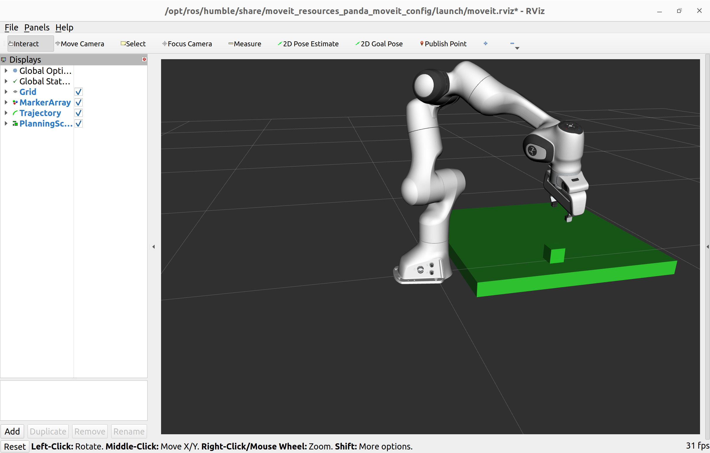
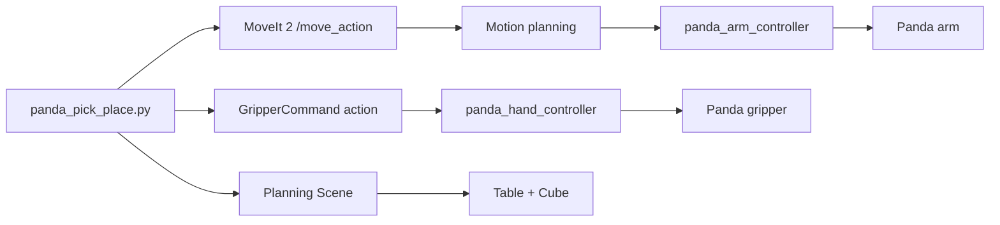

# ROS 2 Panda Pick-and-Place with MoveIt 2

A teaching example for motion planning, planning-scene manipulation, and gripper control with the **Franka Emika Panda** using **ROS 2 Humble**, **MoveIt 2**, Python, and RViz.

> **Scope:** this repository demonstrates a MoveIt/RViz planning-scene simulation. The cube attachment is logical/visual rather than a physics-based grasp. Do not run the example unchanged on a physical robot.

## Demo

<p align="center">
  
</p>

<p align="center"><b>Franka Emika Panda pick-and-place planning scene in RViz using ROS 2 Humble and MoveIt 2.</b></p>

## Project overview

The ROS 2 node sends pose-constrained motion requests to MoveIt, commands the Panda gripper through `GripperCommand`, and updates the MoveIt planning scene with a table and cube.

The demonstrated task is:

**Add scene → Open gripper → Pre-grasp → Descend → Close gripper → Attach cube → Lift → Move to place → Descend → Open gripper → Detach cube → Retreat**



## Learning outcomes

After completing the exercise, students should be able to:

- create and build a ROS 2 Python package with `ament_python`;
- understand ROS 2 actions, services, controllers, and joint states;
- launch a Panda MoveIt configuration in RViz;
- send Cartesian pose constraints to MoveIt;
- add collision objects to a planning scene;
- command the Panda gripper;
- attach and detach an object during a manipulation sequence;
- diagnose common planning and controller problems.

## Tested environment

| Component | Configuration |
|---|---|
| Operating system | Ubuntu 22.04 |
| ROS 2 | Humble |
| Robot | Franka Emika Panda, 7-DoF |
| Motion planning | MoveIt 2 |
| Visualisation | RViz 2 |
| Language | Python 3 |
| Build system | colcon / ament_python |

## Repository structure

```text
ROS2-Panda-Pick-and-Place/
├── package.xml
├── setup.py
├── setup.cfg
├── resource/
│   └── panda_pick_place
├── panda_pick_place/
│   ├── __init__.py
│   ├── add_scene.py
│   ├── pick_place.py
│   └── pick_place_working.py
└── test/
```

The primary teaching program is `panda_pick_place/pick_place.py`.

## 1. Prerequisites

ROS 2 Humble should already be installed and working. Source it before using the package:

```bash
source /opt/ros/humble/setup.bash
```

Useful packages for this exercise include MoveIt 2, the Panda MoveIt resources, ROS 2 control messages, and colcon. If your existing ROS/MoveIt installation already contains these packages, you do not need to reinstall them.

Check ROS:

```bash
echo $ROS_DISTRO
ros2 --help
```

The expected ROS distribution for this tutorial is:

```text
humble
```

## 2. Clone into a ROS 2 workspace

Create a workspace if required:

```bash
mkdir -p ~/franka_ros2_ws/src
cd ~/franka_ros2_ws/src
```

Clone this repository:

```bash
git clone https://github.com/sh1755/ROS2-Panda-Pick-and-Place.git
```

Return to the workspace:

```bash
cd ~/franka_ros2_ws
```

## 3. Install package dependencies

From the workspace root:

```bash
source /opt/ros/humble/setup.bash
rosdep update
rosdep install --from-paths src --ignore-src -r -y
```

## 4. Build

```bash
cd ~/franka_ros2_ws
source /opt/ros/humble/setup.bash
colcon build --packages-select panda_pick_place --symlink-install
source install/setup.bash
```

Check that ROS can find the package:

```bash
ros2 pkg prefix panda_pick_place
```

## 5. Launch the Panda MoveIt demo

### Terminal 1

```bash
source /opt/ros/humble/setup.bash
source ~/franka_ros2_ws/install/setup.bash

ros2 launch moveit_resources_panda_moveit_config demo.launch.py
```

RViz should open with the Panda robot and MoveIt MotionPlanning interface.

Keep this terminal running.

## 6. Run the pick-and-place task

### Terminal 2

```bash
source /opt/ros/humble/setup.bash
source ~/franka_ros2_ws/install/setup.bash

ros2 run panda_pick_place pick_place
```

The node should create the table and cube and then execute the manipulation sequence.

## Task sequence

| Step | Action |
|---:|---|
| 1 | Add table and cube to planning scene |
| 2 | Open Panda gripper |
| 3 | Move above cube |
| 4 | Descend toward grasp pose |
| 5 | Close gripper |
| 6 | Attach cube to Panda hand in planning scene |
| 7 | Lift cube |
| 8 | Move above placement position |
| 9 | Descend |
| 10 | Open gripper |
| 11 | Detach cube and place it in world scene |
| 12 | Retreat upward |

## Planning-scene geometry used in the example

The current teaching example uses approximately:

```text
Table centre:  x = 0.40 m, y = 0.00 m, z = 0.10 m
Table size:    0.70 m × 0.70 m × 0.05 m

Cube centre:   x = 0.45 m, y = 0.00 m, z = 0.15 m
Cube size:     0.05 m

Place centre:  x = 0.35 m, y = -0.25 m, z = 0.15 m
```

Students can modify these values to investigate reachability, collision checking, and motion-planning behaviour.

## ROS 2 interfaces used

The example uses the following interfaces in the MoveIt demo configuration:

```text
/move_action
/execute_trajectory
/panda_arm_controller/follow_joint_trajectory
/panda_hand_controller/gripper_cmd
/apply_planning_scene
/joint_states
```

Inspect the available actions:

```bash
ros2 action list
```

Inspect controllers:

```bash
ros2 control list_controllers
```

Expected active controllers include:

```text
joint_state_broadcaster
panda_arm_controller
panda_hand_controller
```

## Manual gripper test

Open the gripper:

```bash
ros2 action send_goal \
  /panda_hand_controller/gripper_cmd \
  control_msgs/action/GripperCommand \
  "{command: {position: 0.04, max_effort: 20.0}}"
```

Close the gripper:

```bash
ros2 action send_goal \
  /panda_hand_controller/gripper_cmd \
  control_msgs/action/GripperCommand \
  "{command: {position: 0.0, max_effort: 20.0}}"
```

A successful command should finish with a `SUCCEEDED` status.

## Check joint states

```bash
ros2 topic echo /joint_states
```

For the simulated hand, the two finger joint positions should change as the gripper opens and closes.

## How the code works

### MoveIt motion requests

The Python node communicates with MoveIt through the `MoveGroup` action. Each target uses position and orientation constraints. MoveIt plans a collision-aware trajectory for the `panda_arm` planning group and sends the trajectory to the arm controller.

### Planning scene

A table and cube are represented as collision objects. This lets MoveIt consider them during planning.

### Grasp representation

After the gripper closes, the cube is removed from the world collision objects and represented as an attached collision object on `panda_hand`. During placement it is detached and returned to the world planning scene.

This is a **planning-scene representation of grasping**, not contact/force physics.

### Gripper

The gripper is commanded through:

```text
/panda_hand_controller/gripper_cmd
```

using:

```text
control_msgs/action/GripperCommand
```

## Troubleshooting

### `PLANNING_FAILED` or `error=-2`

This normally means MoveIt could not find a valid plan for the requested constraints. Check:

- whether the pose is reachable;
- whether the gripper or robot is colliding with the table/cube;
- target height above the table;
- orientation constraints;
- whether the current robot state is valid.

Try a slightly higher target pose before changing several parameters at once.

### Robot does not move

Check that MoveIt is running:

```bash
ros2 action list | grep move
```

Check controllers:

```bash
ros2 control list_controllers
```

Check joint states:

```bash
ros2 topic hz /joint_states
```

### Package not found

Source both ROS and the workspace:

```bash
source /opt/ros/humble/setup.bash
source ~/franka_ros2_ws/install/setup.bash
```

If necessary, rebuild:

```bash
cd ~/franka_ros2_ws
colcon build --packages-select panda_pick_place --symlink-install
source install/setup.bash
```

### Gripper action not available

Check:

```bash
ros2 action list | grep gripper
ros2 control list_controllers
```

The Panda hand controller must be active.

## Student exercises

1. Change the cube start position and determine the reachable workspace.
2. Change the placement location.
3. Add another collision box and make the robot plan around it.
4. Construct a chair or shelf from multiple box collision objects.
5. Compare successful and failed grasp heights.
6. Record planning time for several target poses.
7. Add a second object and extend the sequence.
8. Replace fixed object coordinates with camera-based object detection.
9. Extend the task with hand gesture, speech, or vision-language commands.
10. Compare RViz planning-scene behaviour with a physics simulator such as Gazebo or Isaac Sim.

## Simulation versus the physical Panda

This repository is intentionally configured as a teaching simulation. RViz visualises robot state and MoveIt planning; it is **not a physics simulator**.

A physical Franka Panda requires additional hardware configuration, networking, the appropriate Franka ROS 2/libfranka stack, controller configuration, safety validation, and careful workspace/velocity/force limits.

**Do not connect this example directly to a physical robot without reviewing every target, collision object, controller, and safety constraint.**

## Suggested lab workflow

For a classroom session:

```text
ROS 2 concepts
      ↓
Panda model in RViz
      ↓
MoveIt motion planning
      ↓
Planning scene
      ↓
Gripper action
      ↓
Pick-and-place
      ↓
Collision obstacle exercise
      ↓
Student extension
```

## Future extensions

This project can be extended toward:

- RealSense-based object detection;
- MediaPipe gesture control;
- speech-commanded manipulation;
- Vision-Language Models (VLMs);
- Vision-Language-Action (VLA) systems;
- MoveIt Task Constructor;
- Gazebo / Isaac Sim physics simulation;
- execution on a physical Franka Panda.

## References

- [ROS 2 Humble documentation](https://docs.ros.org/en/humble/)
- [MoveIt 2 Humble documentation](https://moveit.picknik.ai/humble/)
- [MoveIt 2 Humble Getting Started](https://moveit.picknik.ai/humble/doc/tutorials/getting_started/getting_started.html)
- [MoveIt tutorials](https://moveit.picknik.ai/humble/doc/tutorials/tutorials.html)
- [Franka Robotics](https://franka.de/)

## Author

**Dr Sajjad Hussain**  
Lecturer in Robotics, AI and Control Engineering  
University of Brighton, United Kingdom

## Acknowledgement

Developed as a practical ROS 2 and robotic manipulation teaching example using the open-source ROS 2 and MoveIt ecosystems.

---

If you use this repository for teaching or experimentation, please cite/link the repository so students can access the latest version.
